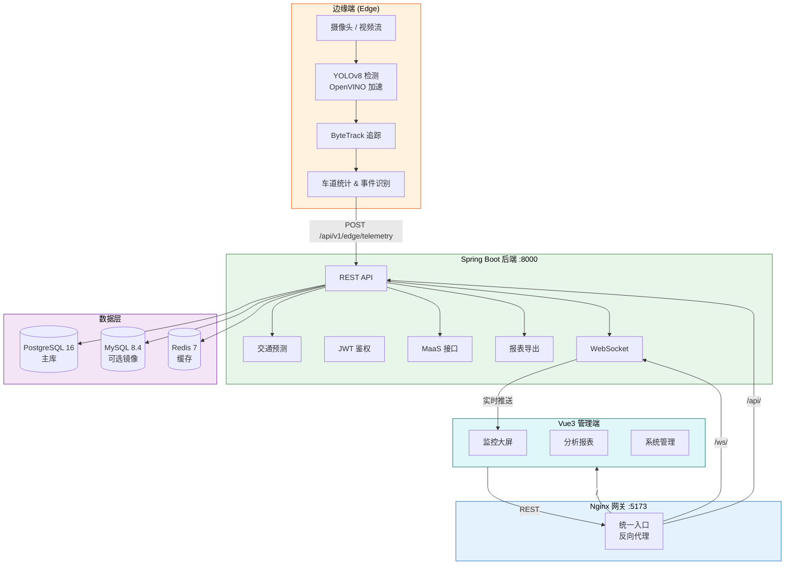

<div align="center">

# Smart Traffic Monitoring System

**基于 Vue3 + Spring Boot + Edge 推理的智能交通监控平台**

[](https://openjdk.org/)
[](https://spring.io/projects/spring-boot)
[](https://vuejs.org/)
[](https://www.typescriptlang.org/)
[](https://python.org/)
[](https://docs.ultralytics.com/)
[](https://www.postgresql.org/)
[](https://redis.io/)
[](https://docs.docker.com/compose/)
[](LICENSE)

</div>

---

## 项目简介

Smart Traffic Monitoring System 是一套面向城市交通管理场景的**端—云协同智能监控平台**。系统在边缘端利用 YOLOv8 + ByteTrack 进行实时目标检测与多目标追踪，借助 OpenVINO 实现推理加速；检测数据主动上报至 Spring Boot 后端，由后端完成数据汇聚、交通预测、事件识别与 MaaS 开放接口服务；Vue3 管理前端提供监控大屏、可视化分析报表与系统管理功能，通过 Nginx 网关统一对外暴露。

---

## 功能亮点

| 模块 | 核心能力 |
|:-----|:---------|
| **边缘推理** | YOLOv8 目标检测（机动车 / 非机动车 / 行人）、ByteTrack 多目标追踪、OpenVINO 加速 |
| **车道统计** | 实时车流量统计、车道占有率分析 |
| **事件识别** | 拥堵检测、异常停车、交通事件自动告警 |
| **交通预测** | 基于历史数据的交通流量趋势预测 |
| **动态道路发现** | 从已启用摄像头自动发现活跃道路，Redis 缓存（TTL 30 s），摄像头变更即时生效，无需重启 |
| **实时推送** | WebSocket 实时推送交通信息与视频帧 |
| **MaaS 开放接口** | 拥堵指数查询（`GET /api/v1/maas/congestion`，API Key 鉴权） |
| **API Key 管理** | 管理员可创建 / 编辑 / 删除 / 重新生成 API Key，支持用量统计（按天查询调用次数、响应时间、状态码分布） |
| **报表导出** | 支持 JSON / XLSX 格式导出 |
| **双库灰度** | PostgreSQL 主库 + MySQL 镜像双写，平滑切换 |
| **安全鉴权** | JWT + Cookie 认证体系，MaaS 独立 API Key |
| **边缘节点 IP 配置** | 摄像头记录 `node_url`（边缘节点 HTTP 服务地址），与视频流 `stream_url` 分离，支持后端直接调用节点 API |
| **管理前端** | 登录、监控大屏、分析报表、系统管理后台 |

---

## 系统架构



---

## 技术栈

| 层级 | 技术 | 说明 |
|:-----|:-----|:-----|
| **前端** | Vue 3.5、TypeScript、Vite 5、Naive UI、ECharts、Vue Router 4 | 现代化 SPA 管理端 |
| **后端** | Spring Boot 3.4、Java 17、Spring Security、JWT (JJWT 0.12)、WebSocket、Flyway | RESTful API + 实时推送 |
| **边缘端** | Python 3、FastAPI 0.115、YOLOv8 (Ultralytics)、ByteTrack、OpenVINO、OpenCV | 本地推理 + 主动上报 |
| **数据库** | PostgreSQL 16（主库）、MySQL 8.4（可选镜像）、Redis 7（缓存） | 多库策略 |
| **网关** | Nginx 1.27 | 统一入口、反向代理 |
| **构建部署** | Docker、Docker Compose、Maven、pnpm | 一键容器化部署 |

---

## 项目结构

```
Smart-Traffic-Monitoring-System/
├── backend/                # Spring Boot 后端 — 鉴权、管理、数据汇聚、预测、MaaS、报表
├── frontend/               # Vue3 管理端 — 监控大屏与可视化分析
├── edge/                   # Python 边缘推理 — YOLOv8 检测、ByteTrack 追踪、上报
├── gateway/                # Nginx 统一入口网关（端口 5173）
├── docs/                   # 部署文档、答辩材料、需求追溯、性能报告
├── scripts/                # 运维脚本 — 门禁、清理、数据库切换、性能测试
├── docker-compose.yml      # 容器编排
└── README.md               # 本文件
```

---

## 快速开始（Docker 一键部署）

> **前提**：已安装 [Docker](https://docs.docker.com/get-docker/) 和 [Docker Compose](https://docs.docker.com/compose/install/)。

### 1. 启动全部服务

```bash
docker compose up --build -d
docker compose ps
```

### 2. 访问

| 入口 | 地址 |
|:-----|:-----|
| 前端（通过网关） | http://localhost:5173/ |
| 后端 API | http://localhost:8000 |

### 3. 联调验证

```bash
# 网关入口正常
curl -I http://localhost:5173/

# /react 路由返回 404（预期行为）
curl -I http://localhost:5173/react/

# 后端健康检查
curl -I http://localhost:8000/api/v1/site-settings
```

---

## 本地分步开发

适用于需要独立调试各模块的场景。

```bash
# 1. 启动基础依赖
docker compose up -d database mysql redis

# 2. 启动后端
cd backend && mvn -B spring-boot:run

# 3. 启动前端（开发模式）
cd frontend && pnpm install && pnpm dev --port 5174

# 4. 启动边缘端（可选，模拟模式）
cd edge && python main.py --mode sim --port 9000 --no-browser
```

---

## 默认账号

系统默认**不内置任何账号**。

- Docker 一键启动后，可直接在登录页点击“注册”创建账号。
- 当系统内还没有任何用户时，首个注册用户会自动成为管理员。
- 如需固定初始化管理员，也可通过环境变量开启初始化管理员：

```bash
INIT_ADMIN=true
INIT_ADMIN_USERNAME=admin
INIT_ADMIN_EMAIL=admin@example.com
INIT_ADMIN_PASSWORD=Admin@12345
```

---

## 环境变量参考

### 后端（项目根目录 `.env`）

| 变量 | 说明 | 示例 |
|:-----|:-----|:-----|
| `SPRING_DATASOURCE_URL` | PostgreSQL 连接 URL | `jdbc:postgresql://localhost:5433/traffic` |
| `SPRING_DATASOURCE_USERNAME` | 数据库用户名 | `postgres` |
| `SPRING_DATASOURCE_PASSWORD` | 数据库密码 | `your_password` |
| `JWT_SECRET` | JWT 签名密钥（≥32 字符随机串） | `a-random-string-at-least-32-chars` |
| `APP_CORS_ALLOWED_ORIGINS` | CORS 允许的域名 | `http://localhost:5173` |
| `INIT_ADMIN` | 是否创建初始管理员 | `true` |
| `INIT_ADMIN_USERNAME` | 管理员用户名 | `admin` |
| `INIT_ADMIN_EMAIL` | 管理员邮箱 | `admin@example.com` |
| `INIT_ADMIN_PASSWORD` | 管理员密码 | `Admin@12345` |
| `APP_MAAS_DEFAULT_API_KEY` | MaaS 默认 API Key | `your-api-key` |

### 前端（`frontend/.env.production`）

| 变量 | 说明 | 示例 |
|:-----|:-----|:-----|
| `VITE_API_HTTP_BASE` | 后端 HTTP 基地址 | `https://your-domain.com` |
| `VITE_API_WS_BASE` | 后端 WebSocket 基地址 | `wss://your-domain.com` |
| `VITE_AMAP_KEY` | 高德地图 Web JS API Key（GIS 地图页） | `your-amap-key` |

### 边缘节点（`edge/.env`，参考 `edge/.env.example`）

| 变量 | 说明 | 示例 |
|:-----|:-----|:-----|
| `MODE` | 运行模式：`sim`（仿真）/ `camera`（摄像头） | `sim` |
| `ROAD_NAME` | 路段名称，与后端摄像头配置保持一致 | `主干道A` |
| `MODEL_NAME` | YOLO 模型文件名 | `yolov8n.pt` |
| `CONF_THRESHOLD` | 检测置信度阈值 | `0.35` |
| `USE_OPENVINO` | 是否启用 OpenVINO 加速 | `false` |
| `FRAME_SKIP` | 每隔多少帧处理一次 | `2` |
| `IMGSZ` | 推理图像尺寸 | `640` |
| `EDGE_NODE_ID` | 节点唯一标识（多节点部署时必填） | `edge-01` |
| `EDGE_API_KEY` | 边缘节点访问密钥，与后端摄像头配置一致 | `edge-secret` |
| `BACKEND_TELEMETRY_URL` | 后端遥测上报地址 | `http://backend:8000/api/v1/edge/telemetry` |
| `TELEMETRY_INTERVAL_SEC` | 遥测上报间隔（秒） | `5` |
| `ANALYSIS_ROI` | 归一化分析区域 `[x1,y1,x2,y2]` | `0.05,0.25,0.95,0.95` |
| `LANE_SPLIT_RATIOS` | 三车道分割比例 `[left,right]` | `0.33,0.66` |
| `SPEED_METERS_PER_PIXEL` | 像素到米的标定系数 | `0.08` |
| `PARKING_STATIONARY_SECONDS` | 违停判定静止秒数 | `8` |
| `WRONG_WAY_MIN_TRACK_POINTS` | 逆行判定最少轨迹点数 | `4` |
| `CAMERA_SOURCE` | 摄像头地址（设备索引或 RTSP URL） | `0` |

---

## Docker 服务清单

| 服务 | 镜像 | 端口映射 | 说明 |
|:-----|:-----|:---------|:-----|
| `database` | `postgres:16` | `5433:5432` | PostgreSQL 主库 |
| `mysql` | `mysql:8.4` | `3307:3306` | MySQL 可选镜像 |
| `redis` | `redis:7-alpine` | `6380:6379` | 缓存 |
| `backend` | 自构建 | `8000:8000` | Spring Boot 后端 |
| `frontend` | 自构建 | — | Vue3 前端（通过 gateway 暴露） |
| `gateway` | 自构建 | `5173:80` | Nginx 统一入口 |

---

## 生产部署

### 部署核心步骤

1. 准备服务器，安装 Docker + Docker Compose
2. 克隆仓库并配置 `.env` 和 `frontend/.env.production`
3. 修改 `JWT_SECRET` 为随机强密码，配置数据库连接
4. 设置 `VITE_API_HTTP_BASE` / `VITE_API_WS_BASE` 为生产域名
5. 执行 `docker compose up --build -d`
6. 配置域名 DNS 指向服务器，按需添加 TLS 证书

### 部署文档

| 场景 | 文档路径 |
|:-----|:---------|
| 本地部署 | [`docs/deploy/local.md`](docs/deploy/local.md) |
| Docker 部署 | [`docs/deploy/docker.md`](docs/deploy/docker.md) |
| 生产部署 | [`docs/deploy/production.md`](docs/deploy/production.md) |

---

## 常用命令

```bash
# 本地门禁（构建 + 测试 + 联调）
./scripts/local-gate.sh

# 清理依赖与构建缓存
./scripts/clean-project.sh

# 停止所有容器
docker compose down
```

---

## 模块文档

| 模块 | 文档 | 说明 |
|:-----|:-----|:-----|
| 后端 | [`backend/README.md`](backend/README.md) | API 接口、数据模型、安全策略 |
| 前端 | [`frontend/README.md`](frontend/README.md) | 页面路由、组件设计、状态管理 |
| 边缘端 | [`edge/README.md`](edge/README.md) | 检测模型、追踪算法、上报协议 |
| 网关 | [`gateway/README.md`](gateway/README.md) | Nginx 配置、路由规则 |
| 文档 | [`docs/README.md`](docs/README.md) | 部署指南、设计文档、性能报告 |
| 脚本 | [`scripts/README.md`](scripts/README.md) | 运维工具使用说明 |

---

## 开源协议

本项目基于 [MIT License](LICENSE) 开源。

---

## API 文档

> 后端同时提供机器可读的 API 文档端点：`GET /api/v1/api-docs`，返回 JSON 格式的完整文档数据，可用于第三方集成。

### 认证方式

系统支持两种认证机制：

| 机制 | 请求头 | 适用端点 | 获取方式 |
|:-----|:-------|:---------|:---------|
| **Bearer Token（JWT）** | `Authorization: Bearer <token>` | 所有需要登录的端点 | 调用 `POST /api/v1/auth/login` 获取 `access_token` |
| **API Key** | `X-API-Key: <your-key>` | MaaS 开放接口 | 由管理员在系统管理后台创建 |

> Token 同时写入 HttpOnly Cookie（`access_token`），WebSocket 连接可通过 Cookie 或 query 参数 `?token=<jwt>` 传递。

---

### 公开 HTTP 端点（无需认证）

| 方法 | 路径 | 描述 |
|:-----|:-----|:-----|
| GET | `/api/v1/api-docs` | 获取机器可读 API 文档（JSON） |
| GET | `/api/v1/site-settings` | 获取站点配置（名称、公告、Logo） |
| GET | `/api/v1/roads_name` | 获取所有已启用道路名称列表 |
| GET | `/api/v1/info/{roadName}` | 获取指定道路实时交通信息 |
| GET | `/api/v1/frames_no_auth/{roadName}` | 获取指定道路摄像头最新帧（JPEG） |
| GET | `/api/v1/traffic/predictions` | 获取指定道路交通流量预测数据 |
| POST | `/api/v1/auth/register` | 用户注册 |
| POST | `/api/v1/auth/login` | 用户登录，返回 JWT |
| POST | `/api/v1/edge/telemetry` | 边缘节点上报遥测数据 |

---

### 需要 Bearer Token 的端点

| 方法 | 路径 | 描述 |
|:-----|:-----|:-----|
| GET | `/api/v1/auth/me` | 获取当前登录用户信息 |
| GET | `/api/v1/frames/{roadName}` | 获取摄像头最新帧（需认证） |
| GET | `/api/v1/reports/traffic/export` | 导出交通报告（JSON / XLSX） |
| PUT | `/api/v1/users/password` | 修改当前用户密码 |
| PUT | `/api/v1/users/profile` | 更新当前用户个人资料 |

---

### 管理员端点（需要 Bearer Token + 管理员权限）

| 方法 | 路径 | 描述 |
|:-----|:-----|:-----|
| GET | `/api/v1/admin/users` | 获取用户列表（分页） |
| PUT | `/api/v1/admin/users/{id}/role` | 修改用户角色（`role_id`: 0=普通用户, 1=管理员） |
| PUT | `/api/v1/admin/users/{id}/status` | 切换用户启用状态 |
| GET | `/api/v1/admin/cameras` | 获取摄像头列表（分页），含 `node_url` 字段 |
| POST | `/api/v1/admin/cameras` | 创建摄像头（可填 `stream_url` 视频流地址和 `node_url` 边缘节点地址） |
| PUT | `/api/v1/admin/cameras/{id}` | 更新摄像头配置（支持更新 `node_url`） |
| DELETE | `/api/v1/admin/cameras/{id}` | 删除摄像头 |
| GET | `/api/v1/admin/resources` | 获取系统资源指标（CPU、内存等） |
| GET | `/api/v1/admin/nodes` | 获取边缘节点健康状态 |
| PUT | `/api/v1/admin/site-settings` | 更新站点配置 |
| GET | `/api/v1/admin/api-clients` | 获取 MaaS API 客户端列表（分页） |
| POST | `/api/v1/admin/api-clients` | 创建 MaaS API 客户端，返回生成的 API Key |
| PUT | `/api/v1/admin/api-clients/{id}` | 更新 API 客户端（名称、描述、限速等） |
| DELETE | `/api/v1/admin/api-clients/{id}` | 删除 API 客户端 |
| POST | `/api/v1/admin/api-clients/{id}/regenerate` | 重新生成 API Key（旧 Key 立即失效） |
| GET | `/api/v1/admin/api-clients/{id}/usage` | 获取 API 客户端调用统计（参数：`days`，默认 30，最大 365） |

---

### MaaS 开放接口（使用 X-API-Key）

| 方法 | 路径 | 描述 |
|:-----|:-----|:-----|
| GET | `/api/v1/maas/congestion` | 获取指定地理范围内的实时拥堵数据 |

**参数：**

| 参数 | 类型 | 说明 | 必填 |
|:-----|:-----|:-----|:-----|
| `min_lat` | query | 最小纬度（-90 ~ 90） | 是 |
| `max_lat` | query | 最大纬度（-90 ~ 90） | 是 |
| `min_lng` | query | 最小经度（-180 ~ 180） | 是 |
| `max_lng` | query | 最大经度（-180 ~ 180） | 是 |

---

### WebSocket 端点

所有 WebSocket 连接需携带 JWT 进行认证（通过 Cookie `access_token` 或 query 参数 `?token=<jwt>`）。

| 路径 | 描述 | 认证 |
|:-----|:-----|:-----|
| `/api/v1/ws/info/{roadName}` | 实时交通信息推送（JSON 数据流） | Bearer Token |
| `/api/v1/ws/frames/{roadName}` | 实时视频帧推送（JPEG 二进制流） | Bearer Token |
| `/api/v1/admin/ws/resources` | 系统资源监控推送（CPU/内存/连接数） | 管理员 Bearer Token |

---

### 请求与响应格式

**通用请求格式：**

```
Content-Type: application/json
Authorization: Bearer <token>
```

**通用响应格式（错误）：**

```json
{
  "status": 400,
  "error": "Bad Request",
  "message": "错误描述"
}
```

**登录响应：**

```json
{
  "access_token": "<jwt>",
  "token_type": "Bearer"
}
```

**交通信息响应示例（`/api/v1/info/{roadName}`）：**

```json
{
  "road_name": "road1",
  "vehicle_count": 42,
  "congestion_level": "moderate"
}
```

---

### curl 示例

```bash
# 用户登录，获取 token
curl -X POST \
  -d 'username=admin&password=Admin@12345' \
  http://localhost:8000/api/v1/auth/login

# 获取道路列表（无需认证）
curl http://localhost:8000/api/v1/roads_name

# 获取实时交通信息（无需认证）
curl http://localhost:8000/api/v1/info/road1

# 获取交通预测（无需认证）
curl 'http://localhost:8000/api/v1/traffic/predictions?road_name=road1&horizon_minutes=60'

# 导出交通报告（需认证）
curl -H 'Authorization: Bearer <token>' \
  'http://localhost:8000/api/v1/reports/traffic/export?format=json&granularity=hourly'

# 导出 Excel 报告（需认证）
curl -H 'Authorization: Bearer <token>' \
  'http://localhost:8000/api/v1/reports/traffic/export?format=xlsx' \
  --output report.xlsx

# MaaS 拥堵查询（使用 API Key）
curl -H 'X-API-Key: your-api-key' \
  'http://localhost:8000/api/v1/maas/congestion?min_lat=30&max_lat=31&min_lng=120&max_lng=121'

# 修改密码（需认证）
curl -X PUT \
  -H 'Authorization: Bearer <token>' \
  -H 'Content-Type: application/json' \
  -d '{"old_password":"old","new_password":"new"}' \
  http://localhost:8000/api/v1/users/password

# 边缘节点上报遥测（无需认证）
curl -X POST \
  -H 'Content-Type: application/json' \
  -d '{"node_id":"node-01","road_name":"road1","vehicle_count":30,"timestamp":"2026-03-10T08:00:00Z"}' \
  http://localhost:8000/api/v1/edge/telemetry

# 获取机器可读 API 文档
curl http://localhost:8000/api/v1/api-docs

# 创建 API 客户端（管理员 Token）
curl -X POST \
  -H 'Authorization: Bearer <admin-token>' \
  -H 'Content-Type: application/json' \
  -d '{"name":"third-party-app","description":"第三方接入","rate_limit":500}' \
  http://localhost:8000/api/v1/admin/api-clients

# 获取 API 客户端列表
curl -H 'Authorization: Bearer <admin-token>' \
  http://localhost:8000/api/v1/admin/api-clients

# 重新生成 API Key（旧 Key 立即失效）
curl -X POST \
  -H 'Authorization: Bearer <admin-token>' \
  http://localhost:8000/api/v1/admin/api-clients/1/regenerate

# 查询 API Key 用量（最近 7 天）
curl -H 'Authorization: Bearer <admin-token>' \
  'http://localhost:8000/api/v1/admin/api-clients/1/usage?days=7'

# 创建摄像头（含边缘节点地址）
curl -X POST \
  -H 'Authorization: Bearer <admin-token>' \
  -H 'Content-Type: application/json' \
  -d '{"name":"cam-01","road_name":"road1","stream_url":"rtsp://192.168.1.100/stream","node_url":"http://192.168.1.100:9000","latitude":31.2,"longitude":121.4}' \
  http://localhost:8000/api/v1/admin/cameras
```

---

## 数据库表结构

数据库迁移由 Flyway 管理（`backend/src/main/resources/db/migration/`），版本 V1 ~ V8。以下列出核心表结构摘要。

### cameras 表

| 字段 | 类型 | 说明 |
|:-----|:-----|:-----|
| `id` | BIGSERIAL | 主键 |
| `name` | VARCHAR(100) | 摄像头名称（唯一） |
| `location` | TEXT | 物理位置描述 |
| `stream_url` | TEXT | 视频流地址（RTSP / HLS 等） |
| `node_url` | VARCHAR(512) | **边缘节点 HTTP 服务地址**（如 `http://192.168.1.100:9000`），用于后端调用节点 API，与 `stream_url` 独立 |
| `road_name` | VARCHAR(100) | 所属道路名称 |
| `latitude` | DOUBLE PRECISION | 纬度 |
| `longitude` | DOUBLE PRECISION | 经度 |
| `enabled` | BOOLEAN | 是否启用（道路发现仅包含已启用摄像头） |
| `created_at` | TIMESTAMP | 创建时间 |

### api_clients 表

| 字段 | 类型 | 说明 |
|:-----|:-----|:-----|
| `id` | BIGSERIAL | 主键 |
| `name` | VARCHAR(100) | 客户端名称（唯一） |
| `api_key` | VARCHAR(255) | API Key（唯一，可重新生成） |
| `enabled` | BOOLEAN | 是否启用 |
| `description` | TEXT | 描述信息 |
| `allowed_endpoints` | TEXT | 允许访问的端点（可选，逗号分隔） |
| `rate_limit` | INT | 每分钟请求限制（默认 1000） |
| `last_used_at` | TIMESTAMP | 最后使用时间 |
| `created_at` | TIMESTAMP | 创建时间 |

### api_usage_logs 表

记录每次 MaaS API 调用详情，用于用量统计。

| 字段 | 类型 | 说明 |
|:-----|:-----|:-----|
| `id` | BIGSERIAL | 主键 |
| `api_client_id` | BIGINT | 关联 api_clients.id |
| `endpoint` | VARCHAR(255) | 请求路径 |
| `method` | VARCHAR(10) | HTTP 方法 |
| `status_code` | INT | 响应状态码 |
| `response_time_ms` | BIGINT | 响应耗时（毫秒） |
| `request_ip` | VARCHAR(45) | 客户端 IP |
| `created_at` | TIMESTAMP | 请求时间 |

> 已建索引：`(api_client_id, created_at)`、`created_at`、`endpoint`，支持高效的用量统计查询。

---

<div align="center">

**Smart Traffic Monitoring System** · 智能交通监控系统

</div>
