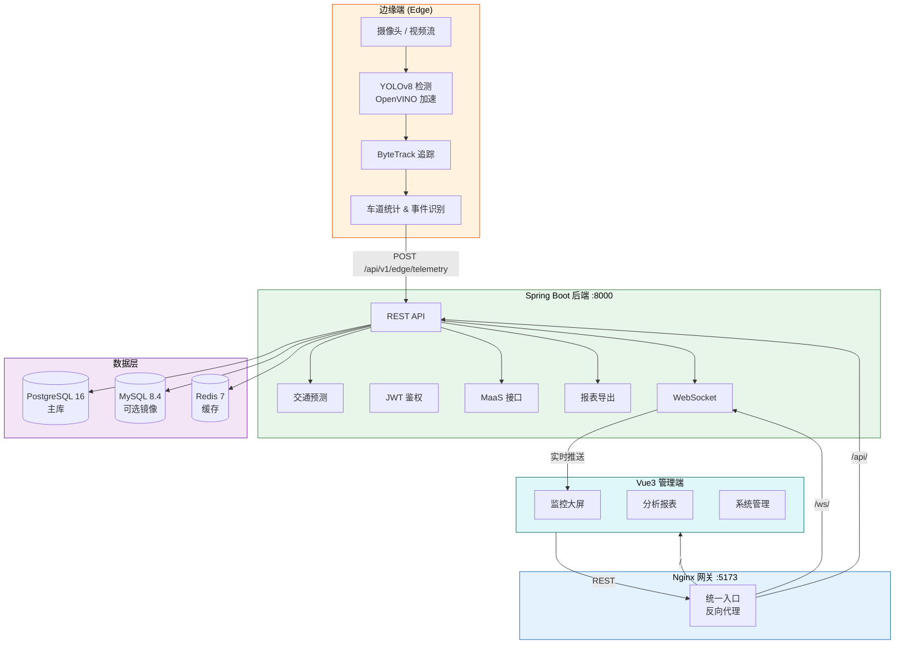

<div align="center">

# Smart Traffic Monitoring System

**基于 Vue3 + Spring Boot + Edge 推理的智能交通监控平台**

[](https://openjdk.org/)
[](https://spring.io/projects/spring-boot)
[](https://vuejs.org/)
[](https://www.typescriptlang.org/)
[](https://python.org/)
[](https://docs.ultralytics.com/)
[](https://www.postgresql.org/)
[](https://redis.io/)
[](https://docs.docker.com/compose/)
[](LICENSE)

</div>

---

## 项目简介

Smart Traffic Monitoring System 是一套面向城市交通管理场景的**端—云协同智能监控平台**。系统在边缘端利用 YOLOv8 + ByteTrack 进行实时目标检测与多目标追踪，借助 OpenVINO 实现推理加速；检测数据主动上报至 Spring Boot 后端，由后端完成数据汇聚、交通预测、事件识别与 MaaS 开放接口服务；Vue3 管理前端提供监控大屏、可视化分析报表与系统管理功能，通过 Nginx 网关统一对外暴露。

---

## 功能亮点

| 模块 | 核心能力 |
|:-----|:---------|
| **边缘推理** | YOLOv8 目标检测（机动车 / 非机动车 / 行人）、ByteTrack 多目标追踪、OpenVINO 加速 |
| **车道统计** | 实时车流量统计、车道占有率分析 |
| **事件识别** | 拥堵检测、异常停车、交通事件自动告警 |
| **交通预测** | 基于历史数据的交通流量趋势预测 |
| **实时推送** | WebSocket 实时推送交通信息与视频帧 |
| **MaaS 开放接口** | 拥堵指数查询（`GET /api/v1/maas/congestion`，API Key 鉴权） |
| **报表导出** | 支持 JSON / XLSX 格式导出 |
| **双库灰度** | PostgreSQL 主库 + MySQL 镜像双写，平滑切换 |
| **安全鉴权** | JWT + Cookie 认证体系，MaaS 独立 API Key |
| **管理前端** | 登录、监控大屏、分析报表、系统管理后台 |

---

## 系统架构



---

## 技术栈

| 层级 | 技术 | 说明 |
|:-----|:-----|:-----|
| **前端** | Vue 3.5、TypeScript、Vite 5、Naive UI、ECharts、Vue Router 4 | 现代化 SPA 管理端 |
| **后端** | Spring Boot 3.4、Java 17、Spring Security、JWT (JJWT 0.12)、WebSocket、Flyway | RESTful API + 实时推送 |
| **边缘端** | Python 3、FastAPI 0.115、YOLOv8 (Ultralytics)、ByteTrack、OpenVINO、OpenCV | 本地推理 + 主动上报 |
| **数据库** | PostgreSQL 16（主库）、MySQL 8.4（可选镜像）、Redis 7（缓存） | 多库策略 |
| **网关** | Nginx 1.27 | 统一入口、反向代理 |
| **构建部署** | Docker、Docker Compose、Maven、pnpm | 一键容器化部署 |

---

## 项目结构

```
Smart-Traffic-Monitoring-System/
├── backend/                # Spring Boot 后端 — 鉴权、管理、数据汇聚、预测、MaaS、报表
├── frontend/               # Vue3 管理端 — 监控大屏与可视化分析
├── edge/                   # Python 边缘推理 — YOLOv8 检测、ByteTrack 追踪、上报
├── gateway/                # Nginx 统一入口网关（端口 5173）
├── docs/                   # 部署文档、答辩材料、需求追溯、性能报告
├── scripts/                # 运维脚本 — 门禁、清理、数据库切换、性能测试
├── docker-compose.yml      # 容器编排
└── README.md               # 本文件
```

---

## 快速开始（Docker 一键部署）

> **前提**：已安装 [Docker](https://docs.docker.com/get-docker/) 和 [Docker Compose](https://docs.docker.com/compose/install/)。

### 1. 启动全部服务

```bash
docker compose up --build -d
docker compose ps
```

### 2. 访问

| 入口 | 地址 |
|:-----|:-----|
| 前端（通过网关） | http://localhost:5173/ |
| 后端 API | http://localhost:8000 |

### 3. 联调验证

```bash
# 网关入口正常
curl -I http://localhost:5173/

# /react 路由返回 404（预期行为）
curl -I http://localhost:5173/react/

# 后端健康检查
curl -I http://localhost:8000/api/v1/site-settings
```

---

## 本地分步开发

适用于需要独立调试各模块的场景。

```bash
# 1. 启动基础依赖
docker compose up -d database mysql redis

# 2. 启动后端
cd backend && mvn -B spring-boot:run

# 3. 启动前端（开发模式）
cd frontend && pnpm install && pnpm dev --port 5174

# 4. 启动边缘端（可选，模拟模式）
cd edge && python main.py --mode sim --port 9000 --no-browser
```

---

## 默认账号

系统默认**不内置任何账号**。

- Docker 一键启动后，可直接在登录页点击“注册”创建账号。
- 当系统内还没有任何用户时，首个注册用户会自动成为管理员。
- 如需固定初始化管理员，也可通过环境变量开启初始化管理员：

```bash
INIT_ADMIN=true
INIT_ADMIN_USERNAME=admin
INIT_ADMIN_EMAIL=admin@example.com
INIT_ADMIN_PASSWORD=Admin@12345
```

---

## 环境变量参考

### 后端（项目根目录 `.env`）

| 变量 | 说明 | 示例 |
|:-----|:-----|:-----|
| `SPRING_DATASOURCE_URL` | PostgreSQL 连接 URL | `jdbc:postgresql://localhost:5433/traffic` |
| `SPRING_DATASOURCE_USERNAME` | 数据库用户名 | `postgres` |
| `SPRING_DATASOURCE_PASSWORD` | 数据库密码 | `your_password` |
| `JWT_SECRET` | JWT 签名密钥（≥32 字符随机串） | `a-random-string-at-least-32-chars` |
| `APP_CORS_ALLOWED_ORIGINS` | CORS 允许的域名 | `http://localhost:5173` |
| `INIT_ADMIN` | 是否创建初始管理员 | `true` |
| `INIT_ADMIN_USERNAME` | 管理员用户名 | `admin` |
| `INIT_ADMIN_EMAIL` | 管理员邮箱 | `admin@example.com` |
| `INIT_ADMIN_PASSWORD` | 管理员密码 | `Admin@12345` |
| `APP_MAAS_DEFAULT_API_KEY` | MaaS 默认 API Key | `your-api-key` |

### 前端（`frontend/.env.production`）

| 变量 | 说明 | 示例 |
|:-----|:-----|:-----|
| `VITE_API_HTTP_BASE` | 后端 HTTP 基地址 | `https://your-domain.com` |
| `VITE_API_WS_BASE` | 后端 WebSocket 基地址 | `wss://your-domain.com` |

---

## Docker 服务清单

| 服务 | 镜像 | 端口映射 | 说明 |
|:-----|:-----|:---------|:-----|
| `database` | `postgres:16` | `5433:5432` | PostgreSQL 主库 |
| `mysql` | `mysql:8.4` | `3307:3306` | MySQL 可选镜像 |
| `redis` | `redis:7-alpine` | `6380:6379` | 缓存 |
| `backend` | 自构建 | `8000:8000` | Spring Boot 后端 |
| `frontend` | 自构建 | — | Vue3 前端（通过 gateway 暴露） |
| `gateway` | 自构建 | `5173:80` | Nginx 统一入口 |

---

## 生产部署

### 部署核心步骤

1. 准备服务器，安装 Docker + Docker Compose
2. 克隆仓库并配置 `.env` 和 `frontend/.env.production`
3. 修改 `JWT_SECRET` 为随机强密码，配置数据库连接
4. 设置 `VITE_API_HTTP_BASE` / `VITE_API_WS_BASE` 为生产域名
5. 执行 `docker compose up --build -d`
6. 配置域名 DNS 指向服务器，按需添加 TLS 证书

### 部署文档

| 场景 | 文档路径 |
|:-----|:---------|
| 本地部署 | [`docs/deploy/local.md`](docs/deploy/local.md) |
| Docker 部署 | [`docs/deploy/docker.md`](docs/deploy/docker.md) |
| 生产部署 | [`docs/deploy/production.md`](docs/deploy/production.md) |

---

## 常用命令

```bash
# 本地门禁（构建 + 测试 + 联调）
./scripts/local-gate.sh

# 清理依赖与构建缓存
./scripts/clean-project.sh

# 停止所有容器
docker compose down
```

---

## 模块文档

| 模块 | 文档 | 说明 |
|:-----|:-----|:-----|
| 后端 | [`backend/README.md`](backend/README.md) | API 接口、数据模型、安全策略 |
| 前端 | [`frontend/README.md`](frontend/README.md) | 页面路由、组件设计、状态管理 |
| 边缘端 | [`edge/README.md`](edge/README.md) | 检测模型、追踪算法、上报协议 |
| 网关 | [`gateway/README.md`](gateway/README.md) | Nginx 配置、路由规则 |
| 文档 | [`docs/README.md`](docs/README.md) | 部署指南、设计文档、性能报告 |
| 脚本 | [`scripts/README.md`](scripts/README.md) | 运维工具使用说明 |

---

## 开源协议

本项目基于 [MIT License](LICENSE) 开源。

---

<div align="center">

**Smart Traffic Monitoring System** · 智能交通监控系统

</div>
